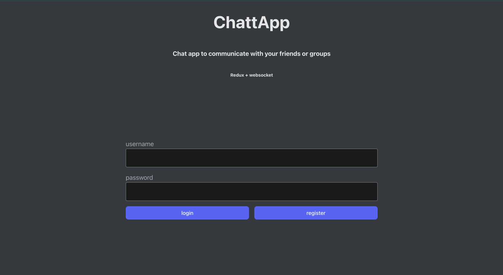
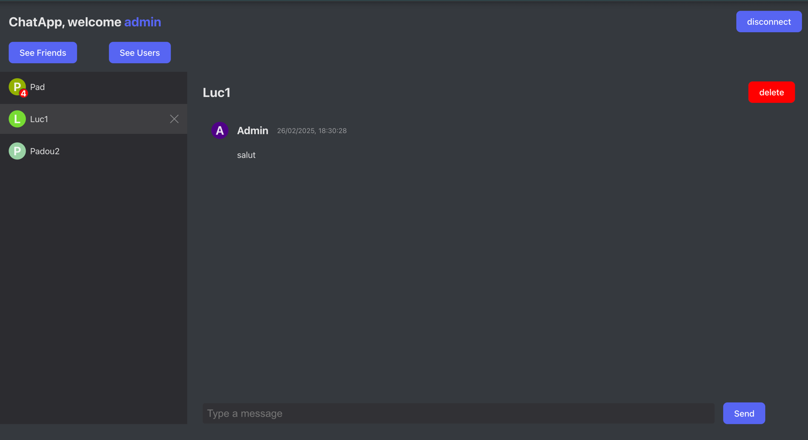
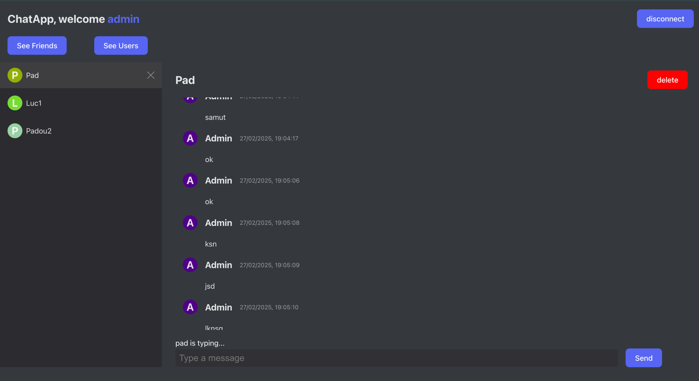
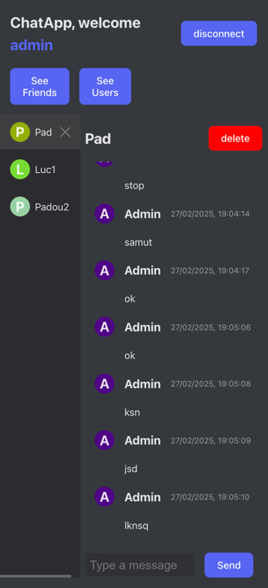

# ChatApp

Chat application using redux and a websocket

## Run

> :warning: **You need docker to run these scripts**

> By default the api run on port **8080** and the client on port **3000**

```bash
./run-all.sh # to start both services
```

```bash
./stop-all.sh # to stop both services
```

To update the config, go to ```/api``` or ```/client```

## Backend

Spring boot + Kotlin + MySQL

Run the api docker:
```bash
make # if you can use makefile

## or

docker compose -f ./docker-compose.yml up --build -d
```

Run the api without docker:
use the **bootRun** command for gradle with the env variable **SPRING_PROFILES_ACTIVE** if you want a specific configuration (for example **dev.pa** if you want to use mine)

## Frontend

React + Typescript + Redux + Websocket

Run the client docker:
```bash
make # if you can use makefile

## or

docker compose -f ./docker-compose.yml up --build -d
```
Run the client without docker:

```bash
# download the dependencies
npm install
yarn

# start the app
npm run dev
yarn dev
```

## In App screenshots





